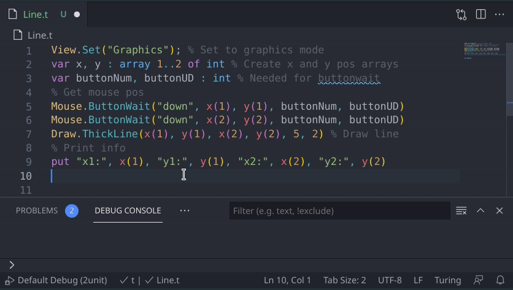

# Turing Vscode

---

Turing Vscode (originally Turing Syntax Highlighting) is a language extension that adds basic language support using [OpenTuring](https://github.com/Open-Turing-Project/OpenTuring).
<div align="center">

  [](https://github.com/Jumner/TuringVscode/releases/) [](https://github.com/Jumner/TuringVscode/commits/main) [](https://github.com/Jumner/TuringVscode/issues)
  [](https://github.com/Jumner/TuringVscode/pulls) [](https://marketplace.visualstudio.com/items?itemName=Jumner.tsh) [](https://github.com/Jumner/TuringVscode/blob/main/LICENSE.txt)

</div>

---
## Features



- Syntax highlighting which makes it look pretty
- Snippets for remembering the intricacies of Turing
- Run turing straight from Vscode
- Basic intellisense for faster programming
- Just hover over any function to learn what it does
- Signature help tells you what parameter you need to enter

Note that I am no longer actively working on the project and so there wont be any versions for a while. If anyone makes a pull request I will probably accept it once I get around to checking on this project. In the meantime, I hope this extension makes your turing experience just a little better.

---

## Requirements

- You must have OpenTuring installed and linked in settings for debugging to work.
- Wine must be installed if you're on Mac/Linux for debugging to work.

#### Dev

Start by cloning the repository
```sh
git clone https://github.com/Jumner/TuringVscode.git && cd TuringVscode
```
Then install all the needed packages just in case
```sh
npm install
```
Install vsce for building the extension
```sh
npm install -g vsce
```
Thats pretty much it, Just hit f5 to debug and you can create a vsix package with
```sh
vsce package
```
---
## Extension Settings

Turing Vscode contributes the following settings:

- `tsh.pathToOpenTuring`: This is the absolute path to turing.exe

---

## Known Issues

1. The autocomplete does not suggest module functions and constants without the module prefix.
2. A few niche functions, keywords and modules are not included. Notably, the Gui module.
3. Signature help shows optional parameters with a question mark like typescript but hover shows the bracket notation as in the Turing documentation.
4. The restart button in Windows debugging still doesn't work.

Please report any issues you discover to the [issue page](https://github.com/Jumner/TuringVscode/issues)

---
## Planned Features
- General code cleanup and bug fixes.
- Prevent autocomplete from stopping newlines which can be annoying when declaring variables.
- Centralizing Turing objects so that descriptions and other properties are only stored in one place. This means grabbing an autocomplete would be asking all the objects for their autocompletes instead of creating new ones with local data that could be different from other features.
- Basic syntax errors could be detected before runtime such as parameter overflow, and type errors.
- Make autocomplete smarter with object oriented turing.
- Possibly switch from regex to textMate syntax highlighting to declutter.

Any wanted features can be reported as an issue under the [issue page](https://github.com/Jumner/TuringVscode/issues) tagged as enhancement

---
## Github Information

- [Github repository](https://github.com/Jumner/TuringVscode)

This is my first Vscode extension and I am pretty new to everything.
Because of this, [pull requests](https://github.com/Jumner/TuringVscode/pulls) would be greatly appreciated if anyone stumbles into this!
Please report any [issues](https://github.com/Jumner/TuringVscode/issues) that you run into when using the extension.

---

## [Release Notes](https://github.com/Jumner/TuringVscode/blob/main/CHANGELOG.md)